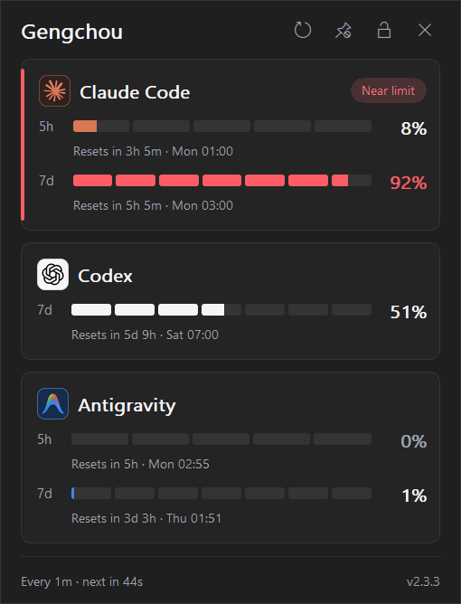
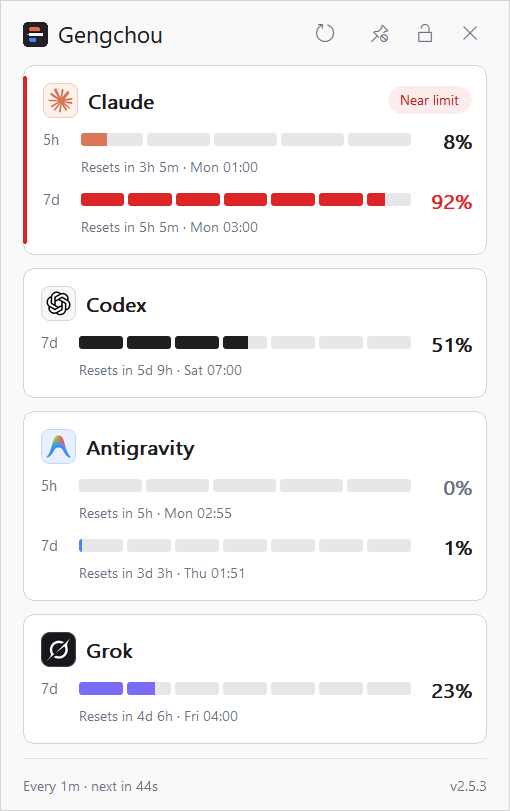
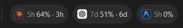
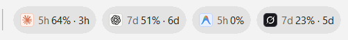
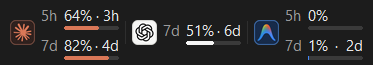
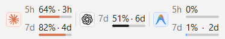
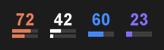
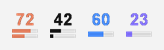
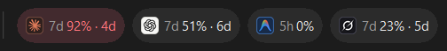

**English** | [简体中文](README.zh-CN.md)

<!-- Keep user-facing behavior, installation, privacy, and release status aligned with README.zh-CN.md. -->
<!-- Every preview image is rendered by the app itself; regenerate with tools\render-readme-images.ps1. -->

<div align="center">

# Gengchou

**AI quota at a glance.**

<sub>AI quota monitor for the Windows taskbar</sub>


[](https://github.com/ynjmxn/gengchou/actions/workflows/ci.yml)
[](https://github.com/ynjmxn/gengchou/releases/latest)
[](LICENSE)

 

<sub>The detail popup in dark and light — including what a near-limit warning looks like.</sub>

</div>

Gengchou puts the quota windows your AI providers actually report — how much
is used, and when it resets — directly on the Windows taskbar. Claude,
Codex, Antigravity, and Grok each get a live percentage on whichever surface
you prefer, from a full detail card down to a single tray number, so checking
your remaining budget never means opening a dashboard.

> 烧香知夜漏，刻烛验更筹。
>
> — Yu Jianwu, 《奉和春夜应令》, Southern Liang

The name *Gengchou* (更筹) comes from the tally sticks used to mark the watches
of the night; by extension, the term can also refer to time itself. These
tally sticks made the passing hours visible; the app does the same for quota
usage and reset cycles.

## Surfaces at a glance

|  | Dark | Light |
| ---: | :--- | :--- |
| **Taskbar widget** |  |  |
| **Floating window** |  |  |
| **Tray icons** |  |  |

These previews are not screenshots: the app rendered them through its own
`--dump-widget`, `--dump-tray-icons`, and `--dump-detail-popup` modes, so they
show the exact pixels the shipped code draws. Regenerate them any time with
[`tools/render-readme-images.ps1`](tools/render-readme-images.ps1).

- **Taskbar widget.** Embeds in the taskbar itself: one content-sized badge
  per provider showing its logo, quota-window label, usage, and reset countdown.
  Hover a badge to see every reported window with reset times. Drag the left
  divider to reposition it, or drop it on another taskbar to change monitors.
  If Explorer is temporarily gone, the widget hides and re-embeds rather than
  landing on the desktop.
- **Floating window.** A separate always-on-top numeric view, not a stretched
  copy of the widget: up to the two highest-usage windows per provider, each
  label, percentage, and countdown aligned above its micro gauge. Drag it from
  anywhere on its surface; a short click still opens the detail popup. It
  remembers its position, keeps an 8-pixel margin inside the work area, and
  can be reset from **Settings**.
- **Tray icons.** One live icon per enabled provider — the number and adaptive
  bars follow whatever quota windows that provider reports; with no data the
  number gives way to the provider's initial. Disable **Provider tray icons**
  to keep a single neutral app icon instead. The app icon also stands in
  whenever no provider has been granted credential access, since there is no
  provider whose mark would be honest to show; your preference is untouched
  and the provider icons return as soon as one is authorized.
- **Detail popup.** Opens from a left-click on any surface: per-provider
  status badges, exact reset clock times, and a live refresh countdown. Its
  separate pin and position-lock controls can keep it open or stop it moving.
  The pin preference survives popup closes and app restarts; position locking
  applies only to the current opening.

When any quota window reaches 90%, it takes over that provider's badge, turns
it red, and shows its own reset countdown — the warning finds you, not the
other way around:

<div align="center">

</div>

## Install

Installation options, in recommended order:

1. **Portable ZIP (recommended).** Download
   `gengchou-windows-x64.zip` from the
   [latest release](https://github.com/ynjmxn/gengchou/releases/latest),
   extract it to any folder you can write to, and run `gengchou.exe`. The
   bundle includes both READMEs and the retained license and attribution
   notices.

2. **Standalone EXE.** For a single-file download, get `gengchou.exe` from
   the same release and run it from any writable folder.

3. **WinGet.** The package is available under this identifier:

   ```powershell
   winget install --id ynjmxn.Gengchou --exact
   ```

   WinGet distribution starts with v2.3.4. The ZIP and EXE remain available
   for portable or manual installations.

To query usage, Gengchou reads credentials or session data already stored on
this PC and sends a credential only to the provider that issued it, over
HTTPS. It does not upload credentials or usage data to Gengchou or any third
party. See [Data & privacy](#data--privacy) before installing for the complete
data-flow and storage details.

The executable is currently unsigned. Each release includes `SHA256SUMS` for
download verification, and self-updates check it automatically. Starting with
v2.1.0, release binaries also carry GitHub artifact attestations; these provide
build provenance but do not replace Authenticode signing.

The similarly named `CodeZeno.ClaudeCodeUsageMonitor` package is the
original project, not this app.

<details>
<summary><b>Build from source</b> (Windows 10/11, stable Rust)</summary>

```powershell
git clone https://github.com/ynjmxn/gengchou.git
cd gengchou
cargo build --release --locked
.\target\release\gengchou.exe
```

</details>

Release maintainers should also follow the
[release checklist](docs/RELEASE_CHECKLIST.md).

## Controls

- **Left-click** the widget or a tray icon to open or close the detail popup.
- The popup is movable and closes on focus loss by default. Use the pin button
  to keep it open and the separate lock button to stop it moving. From left to
  right, the header controls are Refresh, Pin, Position lock, and Close. State
  icons show the current state. All four support Tab / Shift+Tab and Enter /
  Space; Esc always closes the popup.
- **Right-click** any surface, then click **Provider tray icons**, **Widget**, or
  **Floating Window** directly to toggle that surface. Position resets,
  notifications, and start-with-Windows live under **Settings**.
- **Refresh** polls immediately with **Refresh now** or sets the automatic
  interval. Existing values stay visible while the refresh runs; the detail
  footer says only **Refreshing**.

## Beyond the surfaces

- Quota data comes from what each provider actually reports — windows and
  reset times are never guessed or extrapolated
- A new installation shows whichever of Claude, Codex, Google Antigravity, and
  Grok it detects on this machine; enable or disable any combination afterwards
- Windows system colours in High Contrast mode
- Optional reset notifications (off by default)
- Survives `explorer.exe` restarts and RDP / lock-screen transitions; polling
  keeps its cadence while the session is locked, and restoration only rebuilds
  local UI surfaces
- Multi-monitor and multi-taskbar aware
- 11 languages · no telemetry · a single portable executable
- The in-app brand is **更筹** in Simplified Chinese, **更籌** in Traditional
  Chinese, and **Gengchou** in every other language

## Provider requirements

The monitor only reads your existing local sessions — it never creates
accounts or bypasses provider authentication, and what it can show follows
each provider's own account rules:

- **Claude** — a signed-in Claude Code session on Windows or WSL, or a
  signed-in Claude Desktop session on Windows. The CLI executable is not
  required when Desktop has a supported local session. Claude Code credentials
  are checked across Windows and every known usable WSL distribution. Windows
  defaults to `%USERPROFILE%\.claude\.credentials.json`; when
  `CLAUDE_CONFIG_DIR` is set, its `.credentials.json` is used instead. Each WSL
  distribution resolves its own `CLAUDE_CONFIG_DIR` or falls back to
  `$HOME/.claude`
- **Codex** — a signed-in Codex Desktop or CLI session; the CLI executable is
  not required when Desktop has already saved a supported local session.
  Windows resolves `%CODEX_HOME%\auth.json` (normally
  `%USERPROFILE%\.codex\auth.json`) or the Codex entry in Windows Credential
  Manager; if neither is usable, `$CODEX_HOME/auth.json` (default
  `$HOME/.codex/auth.json`) in a **running** WSL distribution is read next
- **Antigravity** — a signed-in Antigravity session; the IDE and the CLI share
  one credential. Windows resolves `gemini:antigravity` in Windows Credential
  Manager; if that is unavailable,
  `$HOME/.gemini/antigravity-cli/antigravity-oauth-token` in a **running** WSL
  distribution is read next
- **Grok** — a signed-in grok CLI session. Windows resolves
  `%GROK_HOME%\auth.json` (normally `%USERPROFILE%\.grok\auth.json`); if that
  is unavailable, `$GROK_HOME/auth.json` (default `$HOME/.grok/auth.json`) in a
  **running** WSL distribution is read next. `auth.json` can hold sign-ins from
  several identity providers; only an entry issued by xAI itself is used, and
  its token is only ever sent to xAI. An `XAI_API_KEY` environment variable is
  not a session and is not read

Codex, Antigravity, and Grok credentials inside WSL are only read from
distributions
that are **already running**. Reading a stopped distribution would start its
virtual machine, and this check runs on a schedule, so Gengchou never wakes WSL
for it. Start the distribution first, then use **Provider access → Detect
providers again** in the context menu to check immediately.

Gengchou automatically finds a usable Claude session. When the Anthropic usage
endpoint confirms that a Windows Claude Code credential has been rejected, it
can run the installed `claude update` command in a hidden background process
(60-second timeout), verify that the local credential actually changed, and
retry the usage endpoint. If no usable CLI credential remains — or the CLI is
not installed — Gengchou can instead use an eligible, unexpired access token
from the current Windows user's Claude Desktop session. Both paths are enabled
by default and have no Settings item. WSL credentials never invoke the Windows
CLI, and network errors or rate limits never cause a credential-source switch.

To disable only `claude update`, set `DISABLE_UPDATES=1` before launching
Gengchou. To disable only Claude Desktop session access, set
`GENGCHOU_DISABLE_CLAUDE_DESKTOP_AUTH=1`. Restart Gengchou after changing either
variable. Claude Code and Claude Desktop can be signed into different accounts;
usable CLI credentials take precedence, so disable Desktop access if that
fallback is not wanted.

Only a CLI version change produces a notification, and it is not optional:
because Gengchou changed something on your machine, it always says so. The
switch that matters is `DISABLE_UPDATES=1`, which stops the update itself.
Credential-only recovery and Desktop session selection stay silent. If no
usable session remains, non-renewable and server-rejected credentials appear as
**Authentication failed** and ask the user to sign in to Claude again; a
provider with no credential at all reports **Not detected** instead. In Claude
Desktop, send a message first to let the normal session flow refresh its
credentials; if monitoring still does not recover, sign out and back in. In
Claude Code CLI, run `claude auth login`. Credential watching resumes
monitoring automatically after sign-in.

Routine provider-detection, quota-reset, and Claude Code update notifications
use the Gengchou app icon and are silent. Only a current credential problem
that needs user action uses the Windows warning glyph and notification sound.

The popup reserves badges for four conditions, in priority order:
**Authentication failed**, **Refresh failed**, **Near limit**, and **Limit
reached**. A network or request failure becomes **Refresh failed** after three
consecutive failures or when its data reaches the stale threshold (the greater
of twice the polling interval and five minutes). A 429 response cools down only
that provider and retries silently while its data is fresh; once stale, it uses
the same **Refresh failed** state. Old values stay visible but muted with **Last
updated … ago**. With no history, initial loading says **Waiting for usage
data**, authentication failure says **Unable to get usage data**, and a
persistent service or request failure says **Temporarily unable to get
usage**. The footer reports whether some or all providers failed to update.

For support, run `gengchou.exe --claude-auth-diagnostics` in a terminal. Only
this explicit command invokes the non-model `claude auth status`; it reports
resolved config paths, file state, expiries, CLI version, and internal reason
codes, followed by the copyable `claude auth login` recovery command. Tokens,
account identifiers, and raw CLI output are excluded. The same safe report is
written to Gengchou's diagnostic log.

On first start Gengchou asks once for permission, explaining that the access is
used only to query usage, consumes no model allowance, and stores no sign-in
information. Permission defaults to **No**, and no credential is read before it
is granted. Once granted, Gengchou checks which providers are signed in on this
machine and shows those providers. If none are detected, it keeps a locally
polled Codex placeholder visible so the first sign-in can be recognized without
changing the user's provider selection. Permission is granted once for every
provider, but revoking stays per provider: use **Provider access** in the
context menu to turn any single one off at any time. Turning a provider off
also stops it being read at all: neither the check at start, the periodic
check, nor **Detect providers again** touches its credentials until you turn
it back on. Gengchou re-reads the original file or Windows Credential Manager
entry as needed, so provider-side token refresh continues to work without
copying the token into Gengchou.

Upgrading from an earlier version does not show the prompt again and keeps the
existing provider selection and permissions as they are. To pick up a newly
installed provider, use **Provider access → Detect providers again**. Gengchou
also checks once shortly after each start and periodically thereafter, and
shows a single notification when it finds a newly signed-in provider; it never
changes what is displayed on its own. The check at startup is what tells you
about a provider added by an upgrade, rather than making you wait out the
first interval.

A provider with no credential on this machine shows **Not detected** in the
detail popup along with a note that it is recognized automatically after
sign-in, and raises no notification — a provider that was never signed in has
nothing to sign in to *again*. **Authentication failed** means a credential
really is there and cannot be used: a Windows file or Credential Manager entry
that is unreadable or malformed, or a credential the provider expires or
rejects. These cases share the same simple recovery: sign in again. A WSL probe
is not classified this way, because it cannot tell a distribution that has no
credential from one that failed to answer; it simply moves on to the next
source, so a provider that lives only inside an unreachable distribution reads
as **Not detected** rather than raising a false sign-in warning.

## Data & privacy

| What | Where |
| --- | --- |
| Settings — including provider permission flags; never tokens | `%APPDATA%\Gengchou\settings.json` |
| Usage cache — percentages, quota-window metadata, and reset times only; never tokens | `%APPDATA%\Gengchou\usage-cache.json` |
| Diagnostics (append-only within each generation; rotated while running; current plus one `.old`) | `%LOCALAPPDATA%\Gengchou\diagnose.log` |

If `%APPDATA%` is unavailable, settings and the usage cache fall back to the
Windows configuration directory and then `%LOCALAPPDATA%`. If no durable path
can be used, the app continues for the current session and shows one storage
warning instead of silently claiming that changes were saved.

Gengchou's own direct writes are limited to the paths above. Claude Desktop
session access is read-only: Gengchou reads the encrypted cache and Chromium
`Local State`, decrypts the cache only in memory, extracts only eligible access
tokens, never extracts or stores a refresh token, overwrites the decrypted JSON
and retained token buffers before release, and does not modify Desktop files.
Unless disabled with `DISABLE_UPDATES`, the separately installed Claude CLI may
update its own installation and credential files according to `claude update`'s
behavior. Installations older than v2.2.4 must first run the retained v2.2.4
bridge twice and complete its verification before moving to v2.3.0 or later.

To uninstall: disable **Start with Windows** if you enabled it, then delete
the executable, `%APPDATA%\Gengchou`, and `%LOCALAPPDATA%\Gengchou`.

Network traffic goes directly to the enabled and explicitly authorized
providers (Anthropic, ChatGPT/Codex, Google, xAI) for read-only usage queries,
plus GitHub for update checks and user-approved update downloads. The app never:

- collects analytics or telemetry, or uploads any files;
- sends credentials anywhere except the provider that issued them;
- starts `claude auth login` or writes credential files directly;
- runs provider commands except the non-model `claude --version` / `claude
  update` recovery described above and the explicit
  `--claude-auth-diagnostics` support command;
- triggers model generation — no `claude -p`, `codex exec`, or calls to
  `/v1/messages`, `/v1/chat/completions`, and similar endpoints.

Proxy selection uses standard `ALL_PROXY` / `HTTPS_PROXY` / `HTTP_PROXY`
environment variables first, then the current Windows user's static system
proxy, and finally a direct connection. Automatic PAC/WPAD scripts are not
executed yet.

Provider bearer tokens travel inside each TLS request, so only configure
proxies you trust.

## Update troubleshooting

After a successful portable update, the previous executable may briefly remain
beside the app as `gengchou.exe.old`. Gengchou now continues to start if a
virus scanner, indexer, or another file handle still has that confirmed backup
open; cleanup is retried on a later launch and the exact path is written to
`%LOCALAPPDATA%\Gengchou\diagnose.log`.

If the file remains and a later update cannot proceed, exit Gengchou, wait for
the process holding the file to release it, delete only the reported `.old`
file beside `gengchou.exe`, and start the app again. Do not delete the running
executable or the update workspace.

## Stability

The project began as a stability rework of the original code. External
`WM_DESTROY`, `explorer.exe` taskbar rebuilds, and RDP session switches
trigger in-process recovery — relaunch is only a last resort — and panics
are logged instead of silently ending the process. See
[PROVENANCE.md](PROVENANCE.md) for the technical summary.

## Acknowledgements & license

Formerly **AI Usage Monitor**, Gengchou was derived from
[CodeZeno/Claude-Code-Usage-Monitor](https://github.com/CodeZeno/Claude-Code-Usage-Monitor)
v1.4.8 (commit `9b29972`). The tray-icon presentation and parts of the Claude
usage polling, caching, cooldown, and rate-limit handling were adapted from or
informed by
[jens-duttke/usage-monitor-for-claude](https://github.com/jens-duttke/usage-monitor-for-claude).
This project is not affiliated with, endorsed by, or sponsored by Code Zeno
Pty Ltd, Anthropic, OpenAI, Google, or xAI. Product names are used only to
describe compatibility; all trademarks belong to their respective owners.

MIT License — see [LICENSE](LICENSE),
[THIRD_PARTY_NOTICES.md](THIRD_PARTY_NOTICES.md), and
[DEPENDENCY_LICENSES.md](DEPENDENCY_LICENSES.md) for retained notices.
