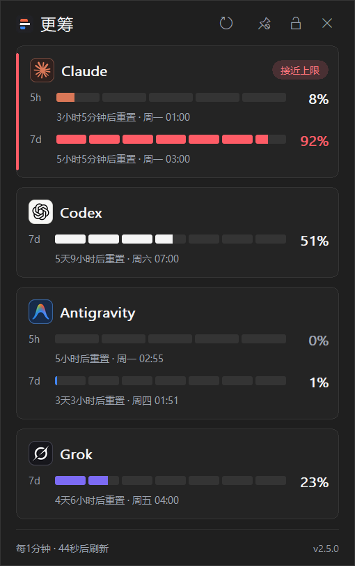
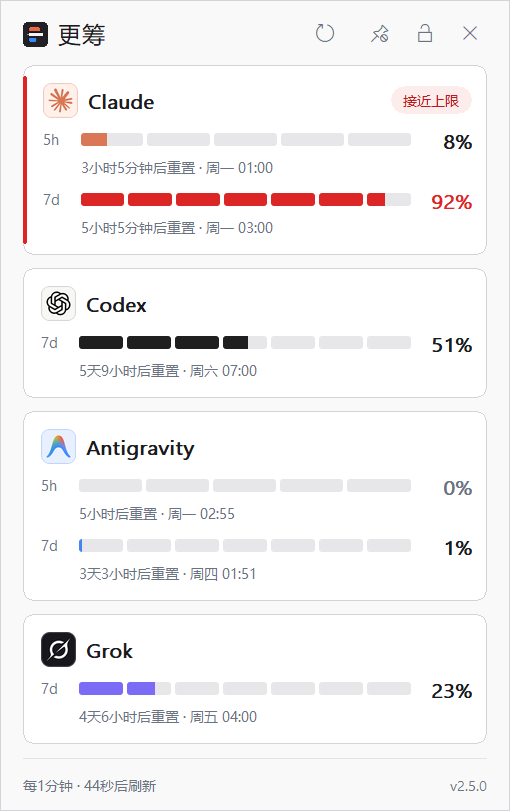

[English](README.md) | **简体中文**

<!-- 修改用户可见行为、安装方式、隐私说明或发布状态时，请同步更新 README.md。 -->
<!-- 所有预览图均由应用自身渲染；用 tools\render-readme-images.ps1 重新生成。 -->

<div align="center">

# 更筹 Gengchou

**AI 配额，一目了然。**

<sub>Windows 任务栏 AI 配额监控工具</sub>


[](https://github.com/ynjmxn/gengchou/actions/workflows/ci.yml)
[](https://github.com/ynjmxn/gengchou/releases/latest)
[](LICENSE)

 

<sub>详情弹窗的深色和浅色主题，图中还展示了接近上限时的警示样式。</sub>

</div>

更筹 Gengchou（读作 `gēng chóu`）把服务商实际返回的配额窗口、已用比例和重置时间直接放到 Windows 任务栏。Claude、Codex、Antigravity 和 Grok 都能实时显示；你可以选择完整的详情卡片，也可以只保留托盘数字，不必再打开各家的控制台查看配额。

> 烧香知夜漏，刻烛验更筹。
>
> ——南朝梁·庾肩吾《奉和春夜应令》

“更筹”是古代夜间计时、报更用的筹签，也可借指时间。

## 视图总览

|  | 深色 | 浅色 |
| ---: | :--- | :--- |
| **任务栏小组件** |  |  |
| **桌面浮窗** |  |  |
| **托盘图标** |  |  |

这些预览图均由应用的 `--dump-widget`、`--dump-tray-icons` 和 `--dump-detail-popup` 模式渲染，显示的是发布代码直接绘制的结果。可运行 [`tools/render-readme-images.ps1`](tools/render-readme-images.ps1) 重新生成。

- **任务栏小组件**嵌入任务栏本体。每家服务商对应一个内容自适应的单行徽章，显示 logo、配额窗口标签、用量和重置倒计时。悬停徽章可查看该服务商报告的所有配额窗口及重置时间；拖动左侧分隔线可调整位置，拖到另一条任务栏即可切换显示器。Explorer 暂时不可用时，小组件会保持隐藏，并在任务栏恢复后重新嵌入。
- **桌面浮窗**是独立的置顶数字视图。每家服务商最多显示两个用量最高的配额窗口，标签、百分比和倒计时排列在各自的微量表上方。桌面浮窗任意位置均可拖动，短按则打开详情弹窗。位置会跨重启保存，并与工作区边缘保持 8 个逻辑像素的间距；也可在**设置**中恢复默认位置。
- **托盘图标**会为每个已启用的服务商显示一枚实时图标。数字和自适应量条取自接口实际返回的配额窗口；暂无数据时显示服务商首字母。关闭**服务商托盘图标**后只保留一个中性软件图标。
- **详情弹窗**可从任意视图左键打开，显示各服务商的状态、精确重置时间和刷新倒计时。固定打开与锁定位置是两个独立控制：固定偏好会跨弹窗关闭和应用重启保留，位置锁定只在本次打开期间生效。

任何配额窗口达到 90% 时，对应服务商的徽章会变红，并显示该窗口的重置倒计时：

<div align="center">

</div>

## 安装

推荐按以下顺序选择安装方式：

1. **便携 ZIP（推荐）。** 从[最新 Release](https://github.com/ynjmxn/gengchou/releases/latest) 下载 `gengchou-windows-x64.zip`，解压到任意可写目录后运行 `gengchou.exe`。压缩包还包含中英文 README、许可证和归属声明。

2. **独立 EXE。** 如需单文件下载，可从同一 Release 获取 `gengchou.exe`，放在任意可写目录直接运行。

3. **WinGet。** 软件包已使用以下标识上架：

   ```powershell
   winget install --id ynjmxn.Gengchou --exact
   ```

   WinGet 从 v2.3.4 开始提供；需要便携安装或手动替换时，仍可使用 ZIP 或 EXE。

为查询用量，更筹会读取本机已有的凭据或会话数据，并仅通过 HTTPS 将凭据发送给签发它的服务商；不会把凭据或用量数据上传给更筹或任何第三方。安装前可阅读[数据与隐私](#数据与隐私)，了解完整的数据流与本地存储范围。

可执行文件目前未做代码签名。每个 Release 都提供 `SHA256SUMS`，应用内更新也会核对校验值。从 v2.1.0 起，发布资产还带有 GitHub artifact attestation，可用于核验构建来源，但不能替代 Authenticode 签名。

名称相近的 `CodeZeno.ClaudeCodeUsageMonitor` 是原项目的软件包，不是本应用。

<details>
<summary><b>从源码构建</b>（Windows 10/11，稳定版 Rust）</summary>

```powershell
git clone https://github.com/ynjmxn/gengchou.git
cd gengchou
cargo build --release --locked
.\target\release\gengchou.exe
```

</details>

发布维护者还应执行[发布检查清单](docs/RELEASE_CHECKLIST.md)。

## 操作方式

- **左键单击**任务栏小组件或托盘图标，打开或关闭详情弹窗。
- 详情弹窗默认可移动，并会在失去焦点时关闭。固定按钮用于保持打开，另一个锁定按钮用于禁止移动。顶部按钮从左到右依次为刷新、固定、位置锁定、关闭；状态图标显示当前状态。四枚按钮均支持 Tab / Shift+Tab、Enter / 空格；Esc 始终关闭弹窗。
- **右键单击**任意视图打开菜单，直接单击**服务商托盘图标**、**任务栏小组件**或**桌面浮窗**即可切换对应视图。位置重置、通知和开机启动等选项位于**设置**。
- 展开**刷新**后，可单击顶部的**立即刷新**，也可选择自动刷新频率。刷新期间继续显示上一次有效数值，详情页脚只显示**正在刷新**。

## 视图之外

- 配额数据来自各服务商实际返回的窗口和重置时间，不做猜测或外推
- 新安装显示在本机探测到的服务商；如果一个也没探测到，会保留一个仅在本地轮询的 Codex 占位项，以便识别首次登录；此后 Claude、Codex、Google Antigravity、Grok 可任意组合启用或关闭
- 高对比度模式下使用 Windows 系统颜色
- 可选的重置通知（默认关闭）
- 在 `explorer.exe` 重启和 RDP/锁屏切换后自动恢复；锁屏期间仍按既定间隔轮询，恢复时只重建本地界面，不额外发送请求
- 支持多显示器、多任务栏
- 11 种语言 · 无遥测 · 单个便携可执行文件
- 软件界面在简体中文下显示**更筹**，繁体中文下显示**更籌**，其他语言统一显示 **Gengchou**

## 服务商要求

本应用只读取本机已有的登录会话，不会创建账户或绕过服务商身份验证。可显示的内容取决于各服务商的账户规则：

- **Claude**：已登录 Windows 或 WSL 中的 Claude Code，或者已登录 Windows Claude Desktop；Desktop 存在受支持的本地会话时无需安装 CLI。Claude Code 凭据会同时检查 Windows 和所有已知可用 WSL 发行版。Windows 默认读取 `%USERPROFILE%\.claude\.credentials.json`，设置 `CLAUDE_CONFIG_DIR` 后改读该目录下的 `.credentials.json`；每个 WSL 发行版按其自身的 `CLAUDE_CONFIG_DIR` 或 `$HOME/.claude` 解析
- **Codex**：已登录的 Codex Desktop 或 CLI 会话；如果 Desktop 已保存受支持的本地会话，无需另外安装 CLI。Windows 侧读取 `%CODEX_HOME%\auth.json`（默认 `%USERPROFILE%\.codex\auth.json`）或 Windows 凭据管理器中的 Codex 条目；如均不可用，再读取**正在运行的** WSL 发行版中的 `$CODEX_HOME/auth.json`（默认 `$HOME/.codex/auth.json`）
- **Antigravity**：已登录的 Antigravity 会话（IDE 与 CLI 共用同一条凭据）。Windows 侧读取凭据管理器中的 `gemini:antigravity`；如不可用，再读取**正在运行的** WSL 发行版中的 `$HOME/.gemini/antigravity-cli/antigravity-oauth-token`
- **Grok**：已登录的 grok CLI 会话。Windows 侧读取 `%GROK_HOME%uth.json`（默认 `%USERPROFILE%\.grokuth.json`）；如不可用，再读取**正在运行的** WSL 发行版中的 `$GROK_HOME/auth.json`（默认 `$HOME/.grok/auth.json`）。`auth.json` 可能同时保存来自多个身份提供方的登录条目，更筹只使用由 xAI 自己签发的条目，且该令牌只会发往 xAI。环境变量 `XAI_API_KEY` 不是会话登录态，不会被读取

Codex、Antigravity 与 Grok 的 WSL 凭据只在发行版**已经在运行**时读取。读取停止的发行版会启动它的虚拟机，而这项检查是按计划执行的，因此更筹不会为此唤醒 WSL。需要时可先启动发行版，再从右键菜单的**服务商访问权限 → 重新探测服务商**触发一次检查。

更筹会自动寻找可用的 Claude 会话。Anthropic 用量接口确认 Windows 侧 Claude Code 凭据失效后，更筹可在隐藏的后台进程中运行已安装 CLI 的 `claude update`（60 秒超时），确认本地凭据确实变化，再重试用量接口。如果没有可用的 CLI 凭据或根本没有安装 CLI，则改用 Windows 当前用户 Claude Desktop 会话中符合条件且尚未过期的访问令牌。两条路径均默认启用，不提供设置菜单项；WSL 凭据不会调用 Windows CLI，网络错误和限流也不会触发凭据来源切换。

如只想关闭 `claude update`，请在启动更筹前设置 `DISABLE_UPDATES=1`；如只想关闭 Claude Desktop 会话读取，请设置 `GENGCHOU_DISABLE_CLAUDE_DESKTOP_AUTH=1`。修改后需要重启更筹。Claude Code 与 Claude Desktop 可能登录不同账户；可用 CLI 凭据始终优先，如不希望在其不可用时改用 Desktop，请关闭 Desktop 会话读取。

只有 CLI 版本确实变化时才发送通知，且该通知不可关闭：更筹动了你机器上的东西，就一定会告知。真正的开关是 `DISABLE_UPDATES=1`，它直接停掉更新本身。仅凭据恢复或改用 Desktop 会话不会打扰用户。没有任何可用会话时，不可续刷和服务端拒绝显示**认证失败**并提示重新登录 Claude；本机完全没有凭据则显示**未检测到**。Claude Desktop 用户可先发送一条消息，让正常会话流程尝试刷新凭据；若监控仍未恢复，再退出并重新登录。Claude Code CLI 用户可在终端运行 `claude auth login`。登录后，凭据监视会自动恢复用量监控。

发现新服务商、配额重置和 Claude Code 更新都属于例行通知：使用更筹应用图标并保持静音。只有当前凭据确实需要用户处理时，才使用 Windows 警告字形和通知声音。

详情弹窗只保留四类徽标，优先级依次为：**认证失败**、**刷新失败**、**接近上限**和**已达上限**。网络或请求故障连续发生 3 次，或数据达到陈旧阈值（自动刷新间隔的 2 倍与 5 分钟取较大值）后，才晋级为**刷新失败**。收到 429 时只暂停对应服务商，并在数据仍新鲜时静默重试；数据陈旧后同样归入**刷新失败**。历史数值继续显示，但会弱化并附上**上次更新于 X 前**。没有历史数据时，首次加载显示**等待用量数据**，认证失败显示**无法获取用量数据**，持续的服务或请求故障显示**暂时无法获取用量**；页脚会说明部分或全部服务商未更新。

需要排查时，可在终端运行 `gengchou.exe --claude-auth-diagnostics`。该命令只在用户主动调用时执行非模型命令 `claude auth status`，输出解析到的配置路径、文件状态、到期时间、CLI 版本和内部原因码，并附上可复制的 `claude auth login`；不会输出 token、账户标识或 CLI 原始响应。安全报告也会写入更筹诊断日志。

首次启动时，更筹会请求一次授权，说明访问仅用于查询用量、不会消耗模型额度、也不会保存登录信息；默认选项为**不允许**，未获授权前不会读取任何凭据。授权后更筹会检查本机有哪些服务商已登录，并显示检查到的那些；如果一个也没探测到，会保留一个仅在本地轮询的 Codex 占位项，以便识别首次登录。授权是一次性的、覆盖全部服务商，但撤销仍然是按服务商的：可随时在右键菜单的**服务商访问权限**中单独关闭某一个。授权后，更筹仍会按需重新读取原文件或 Windows 凭据管理器条目，因此服务商自动刷新令牌的机制可以继续工作，而登录信息不会保存到更筹中。

从旧版本升级时不会再次弹出授权框，现有的服务商选择与授权状态原样保留；如需让更筹检查新装的服务商，请使用**服务商访问权限 → 重新探测服务商**。此后更筹也会定期检查，发现新的已登录服务商时只弹一次通知，不会自行改变显示内容。

如果一个服务商本机没有任何登录凭据，详情弹窗会显示**未检测到**并提示登录后自动识别，不会弹出通知——从未登录过的服务商没有需要「重新登录」的东西。**认证失败**表示已经存在明确的凭据来源，但文件无法读取、格式无效、已经过期、被服务端拒绝或因其他原因不可用；这些情况对用户都归为同一个简单恢复动作：重新登录。如果只是 WSL 探测程序无法启动或没有按时完成，更筹会把它当作暂时刷新失败，不会误报警告式认证通知。

## 数据与隐私

| 内容 | 位置 |
| --- | --- |
| 设置——包括各服务商授权标志，绝不含令牌 | `%APPDATA%\Gengchou\settings.json` |
| 用量缓存——仅百分比、配额窗口元数据和重置时间，绝不含令牌 | `%APPDATA%\Gengchou\usage-cache.json` |
| 诊断日志（每代只追加；运行中自动轮换；仅保留当前文件和一份 `.old`） | `%LOCALAPPDATA%\Gengchou\diagnose.log` |

如果 `%APPDATA%` 不可用，设置和用量缓存会依次回退到 Windows 配置目录和 `%LOCALAPPDATA%`。如果仍找不到可持久写入的位置，应用会继续本次运行并显示一次存储警告，不会静默声称设置已经保存。

更筹自身的直接写入仅限上表路径。Claude Desktop 会话读取是只读的：更筹读取加密缓存和 Chromium `Local State`，只在内存中解密缓存，只提取符合条件的访问令牌，从不提取或保存刷新令牌；释放前会覆盖解密后的 JSON 和保留的令牌缓冲区，也不会修改 Desktop 文件。除非设置 `DISABLE_UPDATES`，另行安装的 Claude CLI 仍可能按照 `claude update` 的行为更新其自身安装和凭据文件。仍低于 v2.2.4 的安装必须先保留并运行 v2.2.4 桥接版两次，完成迁移验证后，才能升级到 v2.3.0 或后续版本。

卸载前，如已启用**开机启动**，请先在菜单中关闭，然后删除可执行文件、`%APPDATA%\Gengchou` 和 `%LOCALAPPDATA%\Gengchou` 两个目录。

网络请求会直接发往已启用且获得明确授权的服务商（Anthropic、ChatGPT/Codex、Google）查询用量；检查更新或用户确认更新时还会连接 GitHub。本应用不会：

- 收集分析或遥测数据，或上传任何文件；
- 将凭据发送给签发者以外的任何一方；
- 启动 `claude auth login`，或直接写入凭据文件；
- 除上述非模型 `claude --version` / `claude update` 自动恢复和用户主动执行的 `--claude-auth-diagnostics` 外，在后台运行其他服务商命令；
- 触发模型生成；不会运行 `claude -p`、`codex exec`，也不会调用 `/v1/messages`、`/v1/chat/completions` 等生成端点。

代理按以下顺序选择：标准 `ALL_PROXY` / `HTTPS_PROXY` / `HTTP_PROXY` 环境变量、Windows 当前用户的固定系统代理、直连。自动 PAC/WPAD 脚本暂不执行。

服务商 Bearer 令牌包含在每个 TLS 请求中，请只配置你信任的代理。

## 更新故障排查

便携版更新成功后，旧程序可能会暂时以 `gengchou.exe.old` 留在程序旁边。如果杀毒软件、索引程序或其他文件句柄仍占用这个已经确认可删除的备份，更筹现在仍会正常启动；后续启动时会再次尝试清理，具体路径会写入 `%LOCALAPPDATA%\Gengchou\diagnose.log`。

如果该文件一直存在，并导致后续更新无法继续，请先退出更筹，等待占用方释放文件，然后只删除日志所指、位于 `gengchou.exe` 旁边的 `.old` 文件，再重新启动。不要删除正在使用的主程序或更新暂存目录。

## 稳定性

本项目最初从原项目的稳定性改造开始。遇到外部 `WM_DESTROY`、`explorer.exe` 任务栏重建或 RDP 会话切换时，应用会先尝试在进程内恢复，只有失败后才重启进程。panic 会写入诊断日志。技术摘要见 [PROVENANCE.md](PROVENANCE.md)（英文）。

## 致谢与许可证

更筹原名 **AI Usage Monitor**，最初派生自 [CodeZeno/Claude-Code-Usage-Monitor](https://github.com/CodeZeno/Claude-Code-Usage-Monitor) v1.4.8（提交 `9b29972`），现已独立开发（[项目起源](PROVENANCE.md)）。托盘图标的呈现方式，以及部分 Claude 用量轮询、缓存、冷却和速率限制处理，改编自或参考了 [jens-duttke/usage-monitor-for-claude](https://github.com/jens-duttke/usage-monitor-for-claude)。本项目与 Code Zeno Pty Ltd、Anthropic、OpenAI 或 Google 不存在从属、认可或赞助关系。产品名仅用于说明兼容性；所有商标归各自权利人所有。

MIT License。保留的许可与归属声明见 [LICENSE](LICENSE)、[THIRD_PARTY_NOTICES.md](THIRD_PARTY_NOTICES.md) 和 [DEPENDENCY_LICENSES.md](DEPENDENCY_LICENSES.md)。
